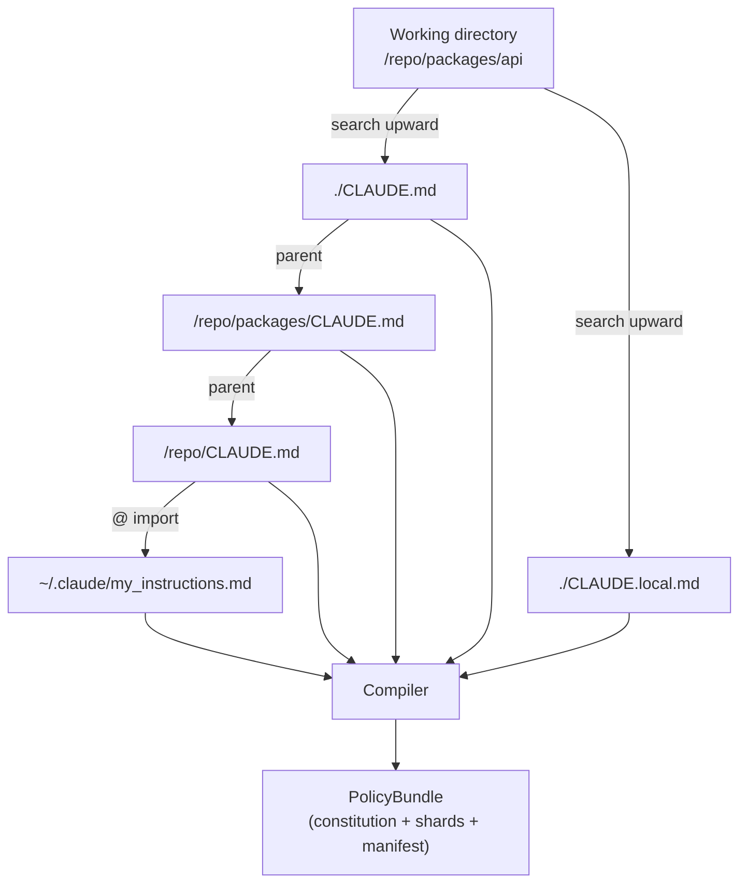
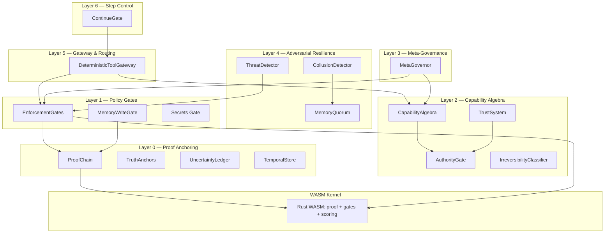
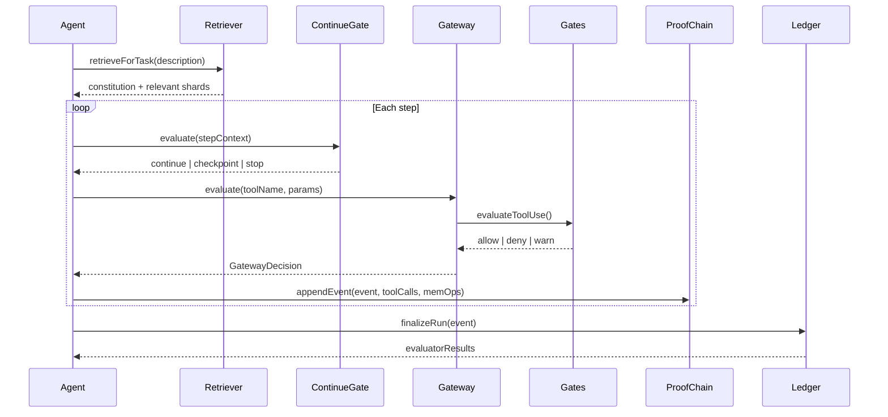
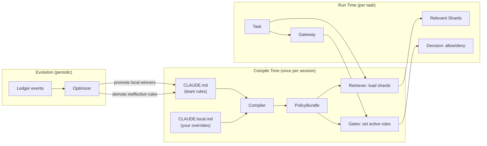

# Architecture Overview

## Starting Point: CLAUDE.md as Memory

In Claude Code, `CLAUDE.md` and `CLAUDE.local.md` are loaded into the agent's working context as raw text. The agent reads them and tries to follow them. This works for simple rules but breaks down at scale:

- The agent can forget rules mid-session
- There's no enforcement — violations are silent
- There's no audit trail — you can't prove what happened
- Rules don't evolve — stale guidance accumulates
- In multi-agent systems, there's no access control over shared memory

The Guidance Control Plane takes these files and turns them into structured, enforceable policy with 7 layers of protection.

## How Guidance Files Are Discovered

Claude Code searches upward from the current directory. Each level can add or override rules. `CLAUDE.local.md` overlays at the same level. The `@import` pattern pulls in files from outside the repo.

## Layer Diagram

## Data Flow

## Layer Descriptions

### Layer 0 — Proof Anchoring

The foundation. Everything that happens is hash-chained and signed.

| Module | Purpose |
|--------|---------|
| **ProofChain** | SHA-256 hash-chained, HMAC-signed envelopes for every run event |
| **TruthAnchors** | Immutable externally-signed facts that agents cannot contradict |
| **UncertaintyLedger** | Probabilistic belief tracking with confidence intervals |
| **TemporalStore** | Bitemporal assertions with validity windows |

### Layer 1 — Policy Gates

Hard enforcement. The model can forget a rule; the gate does not.

| Module | Purpose |
|--------|---------|
| **EnforcementGates** | 4 gates: destructive ops, secrets, diff size, tool allowlist |
| **MemoryWriteGate** | Namespace permissions, rate limits, contradiction detection |

### Layer 2 — Capability Algebra

Fine-grained permissions and trust.

| Module | Purpose |
|--------|---------|
| **CapabilityAlgebra** | Typed permissions with composition, attenuation, delegation |
| **TrustSystem** | Running trust scores from gate outcomes, with decay and tiers |
| **AuthorityGate** | Authority levels (agent → human → institutional → regulatory) |
| **IrreversibilityClassifier** | Labels actions as reversible / costly-reversible / irreversible |

### Layer 3 — Meta-Governance

Governance over the governance system.

| Module | Purpose |
|--------|---------|
| **MetaGovernor** | Constitutional invariants, amendment voting, optimizer constraints |

### Layer 4 — Adversarial Resilience

Byzantine fault tolerance for multi-agent systems.

| Module | Purpose |
|--------|---------|
| **ThreatDetector** | Prompt injection, memory poisoning, privilege escalation detection |
| **CollusionDetector** | Ring topology and unusual frequency detection between agents |
| **MemoryQuorum** | Voting-based consensus for critical memory writes |

### Layer 5 — Gateway & Routing

Single entry point for all tool calls.

| Module | Purpose |
|--------|---------|
| **DeterministicToolGateway** | Idempotency cache + schema validation + budget metering + gates |

### Layer 6 — Step Control

Per-step autonomy decisions.

| Module | Purpose |
|--------|---------|
| **ContinueGate** | continue/checkpoint/throttle/pause/stop based on budget, coherence, rework |

### WASM Kernel

Rust compiled to WebAssembly for hot paths. Transparent JS fallback.

| Module | Purpose |
|--------|---------|
| **proof** (Rust) | SHA-256, HMAC-SHA256, content hashing, chain verification |
| **gates** (Rust) | Secret scanning (8 patterns), destructive detection (12 patterns) |
| **scoring** (Rust) | Shard relevance scoring with domain/risk/keyword bonuses |

## Supporting Modules

These modules operate across all layers:

| Module | Purpose |
|--------|---------|
| **GuidanceCompiler** | Parses CLAUDE.md into PolicyBundle |
| **ShardRetriever** | Similarity-based shard lookup by intent/risk/domain |
| **RunLedger** | Event logging with 5 built-in evaluators |
| **OptimizerLoop** | Analyzes ledger to promote/demote rules, generates ADRs |
| **HeadlessRunner** | Automated compliance testing via `claude -p` |
| **CoherenceScheduler** | Drift detection from violation rate, rework, intent changes |
| **EconomicGovernor** | Multi-dimensional budget tracking and alerting |

## Compile-Time vs. Run-Time

The key lifecycle: `CLAUDE.md` is compiled once at session start. Rules are retrieved per task. The optimizer watches run outcomes and proposes changes back to `CLAUDE.md`, generating an ADR for each change. `CLAUDE.local.md` experiments that consistently reduce violations get promoted to the shared root.

## ADR Index

| ADR | Title |
|-----|-------|
| G001 | Guidance Control Plane |
| G002 | Policy Compilation |
| G003 | Shard Retrieval |
| G004 | Enforcement Gates |
| G005 | Run Ledger and Evaluators |
| G006 | Rule Evolution Pipeline |
| G007 | Hook Integration |
| G008 | Persistent Ledger |
| G009 | Headless Testing |
| G010 | Deterministic Tool Gateway |
| G011 | Artifact Ledger |
| G012 | Evolution Pipeline |
| G013 | Manifest Validator |
| G014 | Cryptographic Proof Chain |
| G015 | Memory Write Gate |
| G016 | Coherence Scheduler |
| G017 | Capability Algebra |
| G018 | Conformance Kit |
| G019 | RuvBot Integration |
| G020 | Meta-Governance |
| G021 | Adversarial Model |
| G022 | Trust System |
| G023 | Truth Anchors, Uncertainty, Temporal |
| G024 | Authority Gate and Irreversibility |
| G025 | WASM Policy Kernel |
